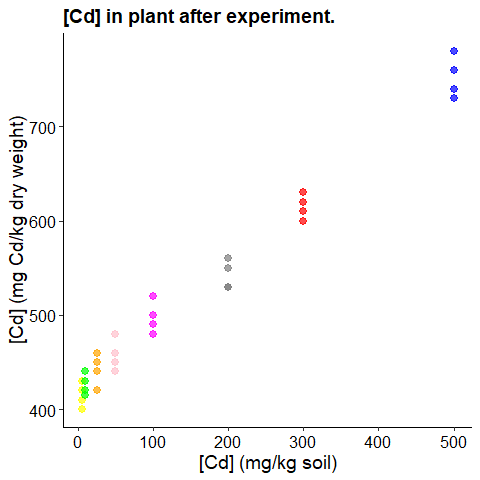
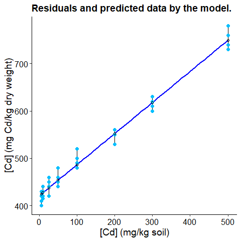
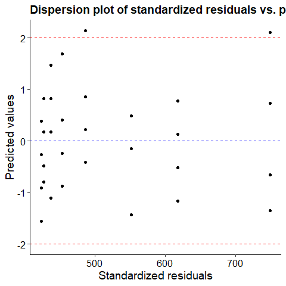
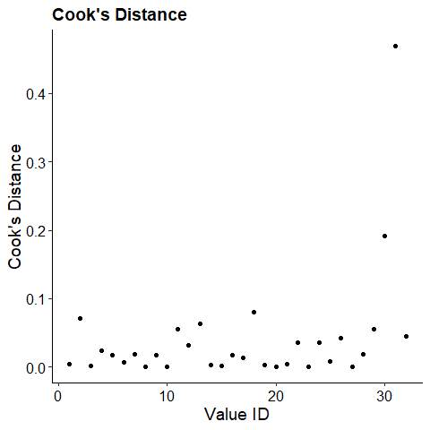
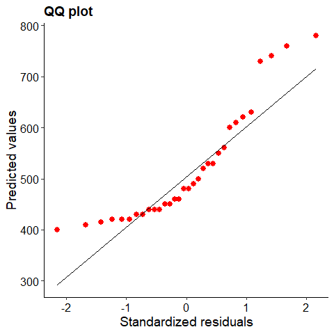

Simple Linear Regression
================

# Aim

We’re interested in studying the detoxifying capacity of *E.
ophiuroides* grass in soils contaminated with Cd (cadmium). We could use
an ANOVA for this tpe of analysis but we also wish to be able to
interpolate within the Cd range evaluated, therefore we’re not going
that way.

# Experimental design

Twenty planters with grass will be assigned one of five different Cd
doses (60, 120, 180, 240, and 300 mg Cd/kg); four pots per dose. After
36 days in the greenhouse, the accumulated Cd in the plant was measured
(expressed as mg Cd/kg dry weight).

# Exploratory analysis

Let’s first inspect what the data looks like.



Based on the graph, we can assume there is a linear relationship between
Cd dose and Cd in the plant.

# Running the model

``` r
lin.reg = lm(Cdenplanta ~ Cd, data=cadmio)
```

# Checking assumptions

``` r
#Residuals + predicted values
e <-residuals(lin.reg) # residuals
re <-rstandard(lin.reg) #standarized residuals
pre <-predict(lin.reg) #predict

# Gather observed data, resid, and predicted values
res <- cbind.data.frame(cadmio$Cd,cadmio$Cdenplanta,pre,e,round(re,2))
colnames(res) <- c("dosis_cd", "cd_tallo", "pred", "resid", "std_resid") 
```

### Residuals and predicted data

    ## `geom_smooth()` using formula = 'y ~ x'



There is no systematic deviation of residuals from the model

### Outlier detection: Observed vs predicted values

We expect all values of standardized residuals to be in range +- 2. As
we can see, there is no major deviations from this assumption.



\###Leveraging points We can study the global effect of one observation
on the model’s estimates by using the Cook’s distance.

    ## Warning: Using `size` aesthetic for lines was deprecated in ggplot2 3.4.0.
    ## ℹ Please use `linewidth` instead.
    ## This warning is displayed once every 8 hours.
    ## Call `lifecycle::last_lifecycle_warnings()` to see where this warning was
    ## generated.



Values with D \> 1 are considered high leveraging. Since we’re not
having any, there are no such datapoints.

### Homocedasticity

We can analyze directly from the datapoints graph, we don’t suspect
there is any treatment with higher or lower variance than the rest.

### Normality tests

#### QQ plot

If the data follows a normal distribution, the quantile-quantile plot
should show the dots aligned with an exact diagonal line.



Albeit showing some skewness at low and high values, in general, linear
models are moderatedly strict about the normality assumption given that
homocedasticity is present.

#### Shapiro-Wilk test

The Shapiro-Wilk test gives us a statistic ranging between 0 and 1. The
closer to 1, the more normality evidence.

``` r
shapiro.test(e)
```

    ## 
    ##  Shapiro-Wilk normality test
    ## 
    ## data:  e
    ## W = 0.96473, p-value = 0.3679

Null hypothesis is normal distribution. We see that there is no reason
to reject it since p-value = 0.9647289, 0.3678543, Shapiro-Wilk
normality test, e

# Analyzing the results

|                 | Estimate | Std. Error | t value | Pr(\>\|t\|) |
|:---------------:|:--------:|:----------:|:-------:|:-----------:|
| **(Intercept)** |  420.8   |    3.79    |   111   |  8.696e-41  |
|     **Cd**      |  0.6574  |   0.0171   |  38.45  |  4.39e-27   |

| Observations | Residual Std. Error | $R^2$  | Adjusted $R^2$ |
|:------------:|:-------------------:|:------:|:--------------:|
|      32      |        15.9         | 0.9801 |     0.9794     |

Fitting linear model: Cdenplanta \~ Cd

Let´s see what the results of the models are:

- The **estimated coefficients** are intercept = 0.66 and slope =
  420.81, both significative.
- **R2 adj.** measures the goodness of fit penalized by variable number
  (i.e controlling overfitting), we´ve got an excellent fitting of 0.98.
- Finally, we’ve got a measurement of the **residual standard error
  (RSE)** (how well/bad our regression model perdicts values). In this
  case, RSE = 15.9, which means that the model predicts Cd in plant with
  an error of 15.9. This is also used for comparison between different
  models (should we fit another linear regression, for example, and we
  wish to compare them).

# Conclusion

The more Cd the soil has, the more is accumulated into the grass plant.
Therefore this species seems to be an effective biological agent to
remove Cd from soils.
